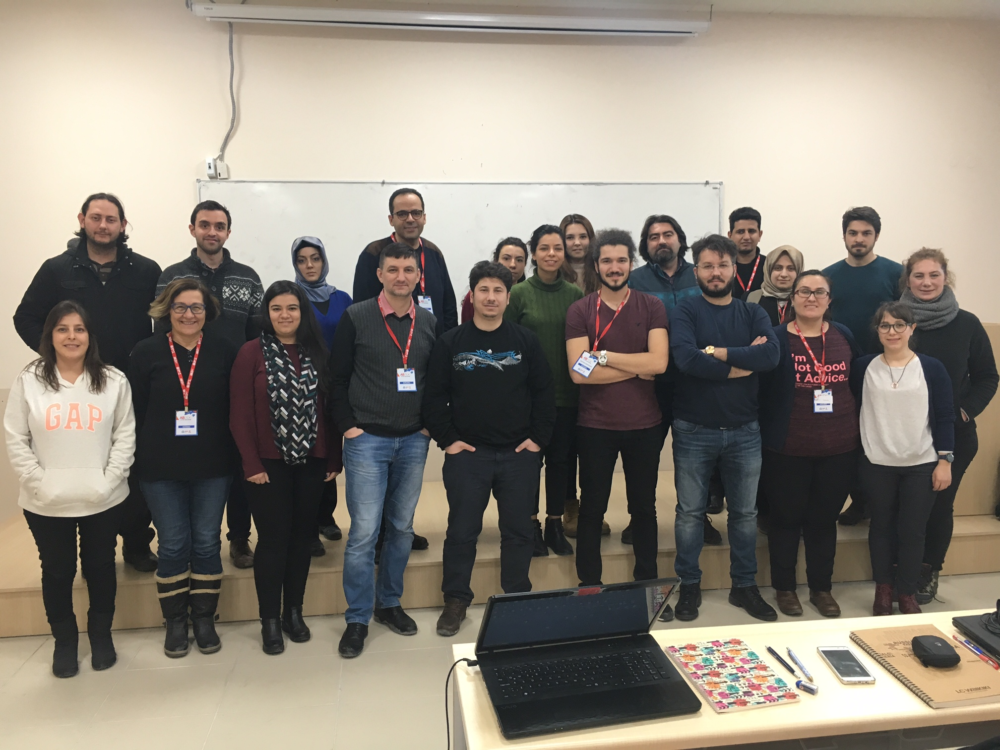

Bu site Akademik Bilişim 2017 kurslarından R ile Veri Analizi'nin dökümanlarını içermektedir. (Eğitmenler: Mustafa Gökçe Baydoğan - Berk Orbay)

## Dökümanlar

Gün 1 - R'ın temelleri. (4 Şubat)

+ [R'a Hızlı Başlangıç](dokumanlar/RHizliGiris.pdf)
+ [R Kodları](https://raw.githubusercontent.com/r338/ab-2017/master/dokumanlar/baslama.R)
+ [Temel R Komutları için Alıştırmalar](dokumanlar/dokuman_temel_alistirma.html)

Gün 2 - R tidyverse ile veri hazırlama, görselleştirme ve raporlama. (5 Şubat)

+ [Gelişmiş örnek: Aksaray seçim raporu](dokumanlar/il_bazi_rapor_Aksaray.html)
+ [dplyr Dökümanları](dokumanlar/dokuman_dplyr.html)
+ [dplyr Alıştırmaları](dokumanlar/dokuman_dplyr_alistirma.html) ([Çözümler](dokumanlar/dokuman_dplyr_alistirma_cozumler.html))
+ [ggplot2 Dökümanları](dokumanlar/dokuman_ggplot2.html)
+ [Örnek Rmd dosyası](https://raw.githubusercontent.com/r338/ab-2017/master/dokumanlar/ornek.Rmd)

Gün 3 - R ile Veri Analizi ve Veri Madenciliğine Giriş (6 Şubat)

+ PCA Kodları [1](https://raw.githubusercontent.com/r338/ab-2017/master/dokumanlar/pca.R)-[2](https://raw.githubusercontent.com/r338/ab-2017/master/dokumanlar/2.R)-[Veri](https://archive.ics.uci.edu/ml/machine-learning-databases/housing/)
+ Önerilen Kaynaklar [1](http://www-bcf.usc.edu/~gareth/ISL/)-[2](http://www.ievbras.ru/ecostat/Kiril/R/Biblio/R_eng/R%20dummies.pdf)

Gün 4 - Uygulama projelerine ayrılmıştır. Bu projelerin amacı ilk 3 gün öğretilen R kabiliyetlerini basit bir uygulama üzerinde sergileyebilmektir.

## Projeler

Bu bölümde 2 kişilik katılımcı gruplarının veri projelerini bulacaksınız. Bu projeler R ve Rmarkdown vasıtasıyla okuyanlar tarafından R'da tekrar üretilebilir şekilde hazırlanmıştır[1](#myfootnote1). Veri dosyaları proje linklerinin yanında bulunabilir.

_(Proje isim sırasına göre)_

+ [2004’ten günümüze Türkiye’de İthal Lüks Otomobil Satışları](projeler/oto.html) ([Veri Dosyası](https://raw.githubusercontent.com/r338/ab-2017/master/projeler/OtomobilSatisRefined.xlsx)) (Sefa Erçek - Haluk Yapıcıoğlu)
+ [Belediyelerde içme suyu şebekesi için çekilen suyun 1994-2014 yılı arasındaki kaynak analizi](projeler/Sular_07022017.html) ([Veri Dosyası](https://raw.githubusercontent.com/r338/ab-2017/master/projeler/sular.csv)) (Utku Erdoğan - İsmail Yoşumaz)
+ [Bitki çeşitliliğinin yükseklik gradientine bağlı olarak incelenmesi.](projeler/nihaldemet.html) ([Veri Dosyası](https://raw.githubusercontent.com/r338/ab-2017/master/projeler/nregresyon.csv)) (Nihal Kenar - Demet Erdönmez)
+ [IMDB Ratings: IMDB verilerini kullanarak, oyuncular, yönetmenler ve ödüllü olup olmamasının IMDB puanlarına etkilerinin analizi.](projeler/projesenaesin.html) ([Veri Dosyası](https://raw.githubusercontent.com/r338/ab-2017/master/projeler/movies.csv)) (Sena Önen - Deniz Esin Emer)
+ [Rüzgar hızı analiz çalışması.](projeler/ruzgar.html) ([Veri Dosyası](https://raw.githubusercontent.com/ismkir/myrepo1/master/arv.csv)) (Zeynep Özger - İsmail Kırbaş)
+ Species distribution modeling with R (Zeycan Helvacı)
+ [TUİK-ARGE faaliyetleri istatistikleri.](projeler/arge.html) ([Veri Dosyası](https://raw.githubusercontent.com/r338/ab-2017/master/projeler/data.xls)) (Merve Yavuz - Funda Güven)
+ [Türkiye havalimanlarının uçak, yolcu ve yük istatistiklerinin analizi.](projeler/ProjeRmarkDown2.html) ([Veri Dosyası](https://raw.githubusercontent.com/r338/ab-2017/master/projeler/data.csv)) (Zeynep Küçükçavdar)

_Not: Buradaki projeler birer R uygulaması olup konularından ve içeriklerinden bağımsız olarak eğitimin R ile ilgili süreçlerini başarıyla tamamlamaları açısından önemlidir. İlgili veriler ve analizler sadece eğitim kapsamı için kullanılmaktadır._

### Diğer projeler

Aşağıdaki veri projeleri çeşitli teknik sebeplerle bütün süreçleri tamamlayamasalar da ilgili R kodlarını ve raporları içermektedir.

+ [OECD ülkelerinde öğretmenlerin ders kitabını yardımcı kaynak olarak kullanımı.](projeler/Alev Elci Projemiz.htm) ([Veri Dosyası](https://raw.githubusercontent.com/r338/ab-2017/master/projeler/OECDdata.xlsx)) (Alev Elçi - Ömer Faruk Yılmaz)
+ [Öğrenci sınav Verilerinden Not elde etme ve grafik çalışması](projeler/YA.html) (Verisi bulunmuyor.) (Yasin Akman)
+ [Türkiye'deki üniversitelerde bulunan akademisyen sayısı ve akademisye başına düşen öğrenci sayısının R ile değerlendirilmesi.](projeler/projerapor.pdf) ([Veri Dosyası](https://raw.githubusercontent.com/r338/ab-2017/master/projeler/ogrencisayisi.xls)) ([Veri Dosyası 2](https://raw.githubusercontent.com/r338/ab-2017/master/projeler/akademisyensayisi.xlsx)) (Halit Irmak - Melih Can Şahin)

<a name="myfootnote1">1</a>: Bazı projelerin açıklamalarında yüklenmesi gereken paketlerin listeleri bulunmayabilir. Bu durumda `tidyverse` paketini yükleyin.

## Muhteşem Kursiyerler

